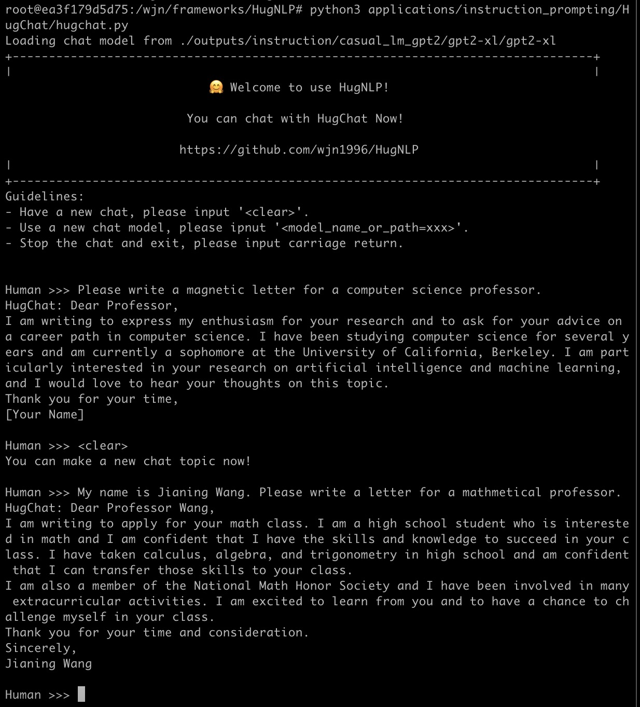
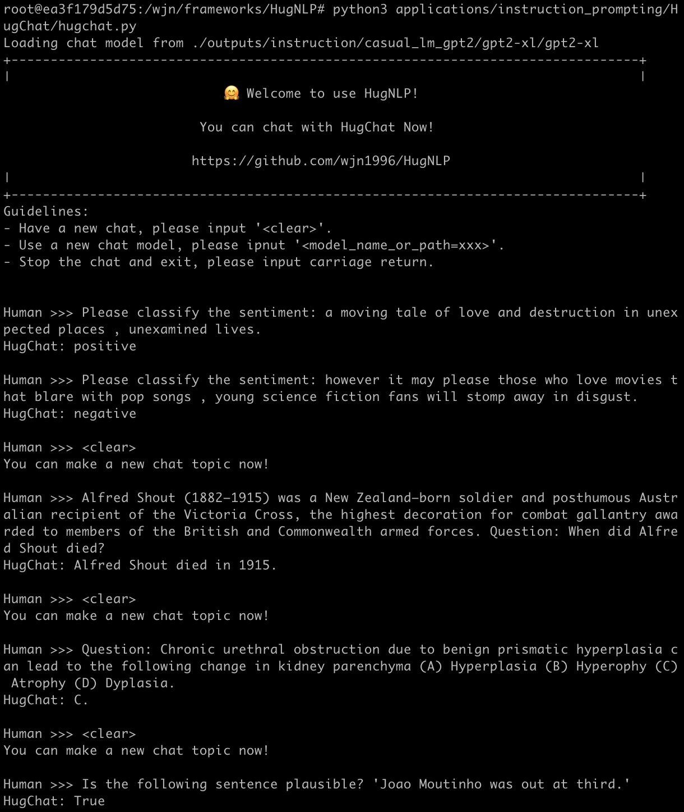

# HugChat: Small ChatGPT-like Models via Generative Instruction-tuning

Generative Instruction-tuning aims to unify all NLP task into generative format to train the causal language model (e.g., GPT2, BART).
This document teach you how to use HugNLP to perform instruction-tuning, and continual train a small ChatGPT-style model on user-defined task-specific corpora.

## HugChat

We develop the HugChat, you can make conversation on terminal. You can run:
```bash
python3 applications/instruction_prompting/HugChat/hugchat.py
```

We demonstrate some examples about GPT2-XL model:


<details><summary><b>1. Write a story</b></summary>


</details>

<details><summary><b>2. Write a letter</b></summary>



</details>

<details><summary><b>3. Calculation</b></summary>


</details>

<details><summary><b>4. Natural Language Understanding (Sentiment, Reading Comprehension, KBQA)</b></summary>



</details>

<details><summary><b>5. Searching</b></summary>


</details>

<details><summary><b>6. Code Programming</b></summary>


</details>


Please Have fun!

---


We will next provide introduction on how to train HugChat.

## Data Preparation

At first, you can prepare instruction corpora in ```instruction_corpora.json```. the format is shown in the following:
```json
{"text": "Human: Please classify the following sentiment. \n Sentiment: My girl friend likes this film, but I don' think so. \n HugChat: Negative. \n\n"},
```
We provide a small file in ```datasets/corpora/instruction/generative_instruction``` to demonstrate this format.

The corpora is released, you can obtain multiple data including:
- MedMCQA: [download](144.214.54.164:5000/MedMCQA.tar.gz)
- MedQA-USMLE: [download](144.214.54.164:5000/MedQA-USMLE.tar.gz)
- PubMedQA: [download](144.214.54.164:5000/PubMedQA.tar.gz)
- Alpaca: [download](https://github.com/tatsu-lab/stanford_alpaca/blob/main/alpaca_data.json)
- Belle_aplaca_cn: [download](https://huggingface.co/datasets/BelleGroup/train_1M_CN)
- Math Instruction: [download](https://huggingface.co/datasets/BelleGroup/school_math_0.25M)
- MultiTurn Chat: [download](https://huggingface.co/datasets/BelleGroup/multiturn_chat_0.8M)
- Prompt Generation: [download](https://huggingface.co/datasets/nomic-ai/gpt4all_prompt_generations_with_p3/tree/main)
- OIG: [download](https://huggingface.co/datasets/laion/OIG/tree/main)
- Others are coming soon ...

The first four dataset (MedMCQA, MedQA-USMLE, PubMedQA and Alpaca) can also be obtained from [LMFlow](https://github.com/OptimalScale/LMFlow).

We have collect these data and obtain 8M training examples (about 11GB). You can download it from [huggingface (
wjn1996/hugnlp-instruction-corpora)](https://huggingface.co/datasets/wjn1996/hugnlp-instruction-corpora), or run the following scripts:
```
cd datasets/corpora/instruction/generative_instruction
bash download_instruction_corpora.sh
```

There are three data:
- instruction_en_corpora.json: only has English data
- instruction_zh_corpora.json: only has Chinese data
- instruction_corpora.json: mixed of English and Chinese.

## Running for Supervised Fine-tuning (SFT)

<!-- We prepare a running script for training a GPT2-XL in ```./application/instruction_prompting/HugChat/supervised_finetuning/run_causal_instruction_gpt2_xl.sh```. -->

At first, you should edit the data_path as ```./datasets/corpora/instruction/generative_instruction``` in the runing script (e.g., ```run_causal_instruction_gpt2_xl.sh```.

You can also define some hyper-parameters, such as:
- --learning_rate=2e-5
- --per_device_train_batch_size=2
- --per_device_eval_batch_size=1
- --gradient_accumulation_steps=2
- ...

We recommend you add the following arguments to use deepspeed:
- --deepspeed=./deepspeed/ds_config_fp16_z1.json \
- --fp16

then run the script:

```bash
bash ./application/instruction_prompting/HugChat/supervised_finetuning/run_causal_instruction_gpt2_xl.sh
```

> If you use deepspeed (ZeRO stage 1 with FP16) and select GPT2-XL to train on 8 V100 (32G) GPUs with 'per_device_train_batch_size=2, gradient_accumulation_steps=2, and epoch=3', The total training steps are 210K, the training time costs about 30 hours. It costs about 28G memory at each GPU.

## Pre-built HugChat Models

We design HugChat application based on generative instruction-tuning.
We have trained following models based on SFT, and release the weights at Huggingface:

| Backbone | Size | Corpora | Config | Progress | Script | HuggingFace Model Link
| --- | --- | --- | --- | --- | --- | --- |
| GPT-2 | base (0.3B) | English | V100 8*32G | Finish | [run_causal_instruction_gpt2.sh](../../applications/instruction_prompting/HugChat/supervised_finetuning/run_casual_instruction_gpt2.sh) | [wjn1996/hugnlp-hugchat-gpt2](https://huggingface.co/wjn1996/hugnlp-hugchat-gpt2)
| GPT-2 | large (0.8B) | English | V100 8*32G | Finish | [run_causal_instruction_gpt2.sh](../../applications/instruction_prompting/HugChat/supervised_finetuning/run_casual_instruction_gpt2.sh) | [wjn1996/hugnlp-hugchat-gpt2-large](https://huggingface.co/wjn1996/hugnlp-hugchat-gpt2-large)
| GPT-2 | xlarge (1.3B) | English | V100 8*32G | Finish | [run_causal_instruction_gpt2_xl.sh]((../../applications/instruction_prompting/HugChat/supervised_finetuning/run_casual_instruction_gpt2_xl.sh)) | [wjn1996/hugnlp-hugchat-gpt2-xl](https://huggingface.co/wjn1996/hugnlp-hugchat-gpt2-xl)
| OPT | 1.3B | English | V100 8*32G LoRA (dim=8) | Finish | [run_causal_instruction_opt.sh]((../../applications/instruction_prompting/HugChat/supervised_finetuning/run_casual_instruction_opt.sh)) | [wjn1996/hugnlp-hugchat-opt-1.3b](https://huggingface.co/wjn1996/hugnlp-hugchat-opt-1.3b)
| OPT | 6.7B | English | V100 8*32G ZeRO-3 FP16 LoRA (dim=8) | Finish | [run_causal_instruction_opt_lora.sh]((../../applications/instruction_prompting/HugChat/supervised_finetuning/run_causal_instruction_opt_lora.sh)) |
| OPT | 13B | English | V100 8*32G ZeRO-3 FP16 LoRA (dim=8) | Developing | [run_causal_instruction_opt_lora.sh]((../../applications/instruction_prompting/HugChat/supervised_finetuning/run_causal_instruction_opt_lora.sh)) |
| GLM-2B | 2.0B | English | V100 8*32G | Pending | |
| GPT-Neo | 1.3B | English | V100 8*32G ZeRO-1 FP16 | Finish | [run_causal_instruction_gpt_neo.sh](../../applications/instruction_prompting/HugChat/supervised_finetuning/run_causal_instruction_gpt_neo.sh) | [wjn1996/hugnlp-hugchat-gpt-neo-1.3B](https://huggingface.co/wjn1996/hugnlp-hugchat-gpt-neo-1.3B) | [wjn1996/hugnlp-hugchat-gpt-neo-1.3B](https://huggingface.co/wjn1996/hugnlp-hugchat-gpt-neo-1.3B)
| GPT-Neo | 2.7B | English | V100 8*32G ZeRO-3 FP16 | Finish | [run_causal_instruction_gpt_neo.sh](../../applications/instruction_prompting/HugChat/supervised_finetuning/run_causal_instruction_gpt_neo.sh) | [wjn1996/hugnlp-hugchat-gpt-neo-2.7B](https://huggingface.co/wjn1996/hugnlp-hugchat-gpt-neo-2.7B)
| LLaMA | 7B | English | V100 8*32G | Pending |  | 

---

## 免责声明(Disclaimer)：

所使用的模型和数据均为开源资源，且当前训练的模型属于SFT(Supervised Fine-tuning)模型，可能存在如下缺陷：

- 在涉及事实性的指令上可能会产生违背事实的错误回答。

- 对于具备危害性的指令无法很好的鉴别，由此会产生危害性言论。

- 在一些涉及推理、代码等场景下模型的能力仍有待提高。

所开源的模型和技术方案仅供research，禁止商用，由于使用者恶意使用导致的法律道德诉讼等危害或风险，本框架团队概不负责。所有解释权归本框架团队所有。


The models and data used are all open source resources, and the currently trained model belongs to the SFT (Supervised Fine-tuning) model, which may have the following defects:

- There may be false answers to factual instructions.

- Inability to identify harmful instructions well, resulting in harmful remarks.

- The ability of the model in some scenarios involving reasoning, code, etc. still needs to be improved.

The open-source models and technical solutions are for research only, and commercial use is prohibited. The framework team is not responsible for any harm or risk such as legal and moral litigation caused by malicious use by users. All interpretation rights belong to the HugNLP framework team.

## Cite Me

```latex
@misc{wang2023hugnlp,
  doi       = {10.48550/ARXIV.2302.14286},
  url       = {https://arxiv.org/abs/2302.14286},
  author    = {Jianing Wang, Nuo Chen, Qiushi Sun, Wenkang Huang, Chengyu Wang, Ming Gao},
  title     = {HugNLP: A Unified and Comprehensive Library for Natural Language Processing},
  year      = {2023}
}
```
